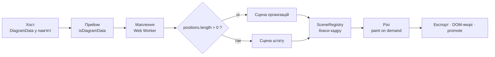
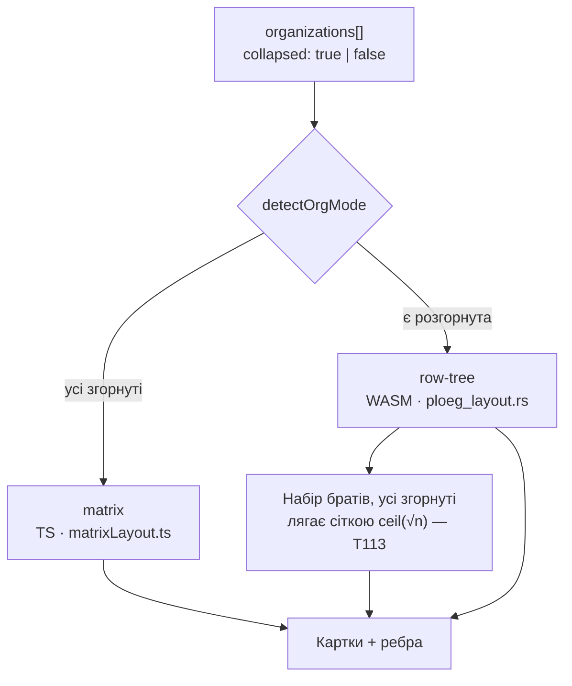
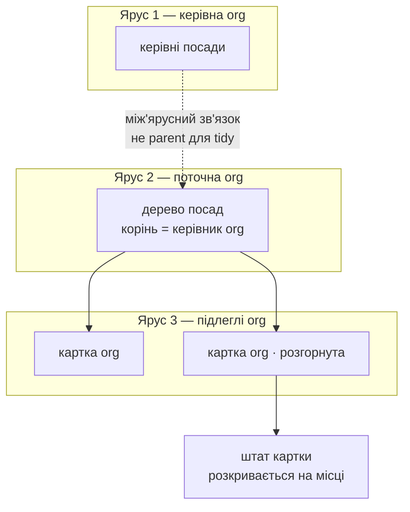

# Сцени та їхні найбільші кейси

Дві сцени SDK і те, як кожна тримає масштаб. **Числа зміряні**, не оцінені;
базис — `main @ eb998e5`, реліз `0.5.1`.

Візуальна версія цієї довідки: [артефакт «Сцени Org Hierarchy»](https://claude.ai/code/artifact/244c3528-bc1b-499d-ae0e-13eb38bbbc37).

⚠️ Де схема й код розійдуться — **виграє код**. Первинні джерела:
[`work/SPEC.md`](../../work/SPEC.md), [`work/CTO-RESEARCH.md`](../../work/CTO-RESEARCH.md),
[`docs/USAGE.md`](../USAGE.md).

---

## 1. Спільний конвеєр

До розвилки на сімейства обидві сцени проходять один шлях. Розвилка — рівно
одна умова: `positions.length > 0`.

| Вузол | Що про нього треба знати |
|---|---|
| **Worker** | `useWorker: true` лежить у **базовому** конфігу демо, тож справжній Worker ганяють усі 87 e2e: не піднявся б — не було б кадру. Юніти ганяють **mock**. |
| **paint on demand** | Спільного тикера немає (`autoStart: false`). Хто зрушив пікселі — просить `requestPaint`. Намалював в обхід — картинка не оновиться, і жоден тест на дані цього не побачить. |
| **SceneRegistry** | Бокси **останнього успішного** кадру. Чиститься на **вході** кадру, тож після впалої розкладки на канві стоїть попередній кадр, а `listTestAnchors()` порожній. |
| **Межа WASM↔TS** | Одна точка входу після T80 (було три). Контур малюється в TS. |

---

## 2. Організації — matrix / row-tree

Режим вибирають самі дані, прапорця немає.

⚠️ **T113: правило локальне й рекурсивне.** Сіткою лягає будь-який набір
братів, усі члени якого згорнуті — на **кожному** рівні, а не лише коли
згорнуто всю діаграму. `getOrgMode()` і `onOrgModeChange` при цьому кажуть про
**діаграму**, а не про набір.

### Найбільший кейс — 100 000 організацій

| Що | Значення | Звідки |
|---|---:|---|
| Адресний простір | 100 000 | `SCALE_ORG_TOTAL` |
| Матеріалізовано карток | 400 | `SCALE_ORG_WINDOW` |
| Частка в пам'яті | 0,4 % | вікно ÷ простір |
| Chrome на картці | вимкнено | `orgTreeChrome: false` |

🔑 **Вікно — патерн хоста, а не вміння SDK.** SDK лише повідомляє, що видима
область змінилась (`onViewportChange`, `settled`), і приймає новий зріз через
`setData`. Арифметика вікна живе в демо
(`packages/demo/src/app/viewportWindow.ts`).

### Стеля глибини

Row-tree рахує WASM, і глибокий вхід йому небезпечний. Гвардія
`MAX_ROW_TREE_DEPTH = 2500` відсікає його **до** входу в модуль.

| Середовище | Головний потік | Воркер |
|---|---:|---:|
| Chromium | 7 625 | **3 937** |
| Firefox | 5 812 | **3 250** |
| Node (нативно) | 6 875 | — |

🔴 **Тип помилки не є ознакою виживання.** На свіжій сторінці навіть 50 000
дають чистий `RangeError` і живий модуль. Труїть не глибина, а **кількість
зривів на одному інстансі**: у Chromium п'ятий зрив убиває модуль, і побачити це
можна лише на **наступному** валідному виклику — той, що вбив, сам повернув
`RangeError`. Гвардію свідомо не піднято: 3 250 × 0,77 ≈ 2 500.

---

## 3. Штат — три яруси

Полотно розбите на три вертикальні блоки. Поточна org завжди в **ярусі 2**.

Розкладка рахується у **локальній СК кожної org** і компонується в world через
зсув ярусу. Інваріант: будь-який staff-pass (tree / matrix / hybrid) дає кожній
видимій посаді `{ x, y, width, height }` у локальних px.

### Найбільший кейс — 1 000 000 посад

| Ярус | Посад | Як влаштований |
|---|---:|---|
| 1 — керівна org | 4 | `LEAD_SEATS` |
| 2 — поточна org | 700 000 | `CURRENT_SEATS` |
| 3 — підлеглі | 299 996 | 12 org, з них 2 у групах |
| **Разом** | **1 000 000** | `STAFF_SCALE_TOTAL` |

| Що справді в пам'яті | Значення | Звідки |
|---|---:|---|
| Вікно ярусу 2 | 600 | `STAFF_SCALE_WINDOW` |
| Вікно картки ярусу 3 | 24 | `SUBORDINATE_WINDOW` |
| Частка в пам'яті | 0,06 % | вікно ÷ простір |

🔑 **Пошук по мільйону не сканує мільйон.** Ім'я посади —
`FIRST[i % 10] + LAST[(i >> 2) % 10]`, тобто дві конгруенції з періодами 10 і
40. Збіги утворюють арифметичну послідовність `first + 40k`, тож індекс не
потрібен. Побічний наслідок: із ста пар імен досяжні лише **сорок**.

---

## 4. Що коштує кадр

Кожне число нижче колись було припущенням, і припущення виявилось хибним.

| Операція | Variant B | Найбільший кейс | Висновок |
|---|---:|---:|---|
| Кадр превʼю при перетягу | 8,3 мс | 8,4 мс | зі сценою **не росте** (частка 1,01) |
| Дроп жестом | 10,3 мс | 216 мс | платить коміт, не колізія |
| **Відмовлений** дроп | — | 579 → **22,4 мс** | був повний кадр за жест, що нічого не змінив |
| **Успішний** коміт | — | **745 мс** | ⚠️ не подешевшав — правка чіпала відмову |
| Плоске дерево 20 000 | 2 912 мс | 105 мс | після зняття трьох рекурсій (T102) |

⚠️ **Половина, яка лишається.** Відмовлений дроп подешевшав у **26 разів**, бо
на всіх шести гілках відмови дані недоторкані — відкочувати нема чого. Але
**успішне** редагування на великій сцені досі коштує **0,75 с замерзлого
кадру**: там дані справді змінились, і кадр треба. Це виміряно незалежним
прогоном після правки, а не припущено.

🔴 **Дефект, знайдений і закритий того ж дня.** Промоут ховає Pixi-в'юху, а
растровий експорт знімає `app.stage` — невидимих дітей не малює. Хост, який
увімкнув промоут **заради** багатих карток, експортував діаграму **без жодного
вузла**: 60 634 Б → 34 085 Б, лінії й підписи лишались, картки зникали. Тепер
експорт знімає промоут на час кадру — байт у байт однаково.
