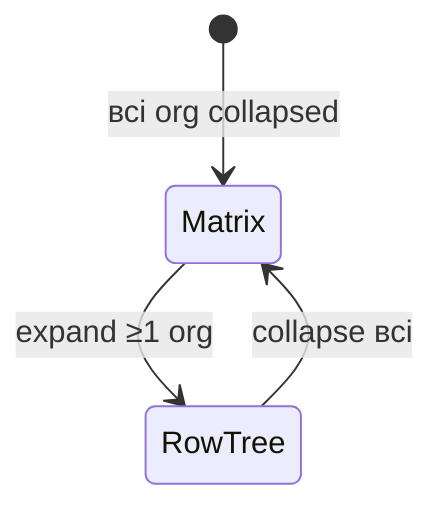

# Специфікація Org Hierarchy SDK — алгоритми та стан

> Документ зафіксовано за результатами обговорення та поточної імплементації.  
> Дата: 2026-08-20. Версія scope: **v1**.

---

## 1. Продукт

**Embed-бібліотека** `@org-hierarchy/sdk` для діаграм:

- **Організаційної ієрархії** (~50 000 org, matrix / row-tree)
- **Штатно-посадової структури** (dept contours, person nodes)

Host завантажує дані зовні → передає через `DataMapper` → `OrgHierarchyDiagram.create()`.

| Параметр | Значення |
|----------|----------|
| Масштаб dataset | ~50k org, ~2M persons |
| Одночасний рендер | viewport + LOD (не всі 2M nodes) |
| Логіка | клієнт (browser) |
| Threading | Web Worker (не Service Worker) |
| Core compute | Rust → WASM |
| Render | Pixi.js WebGL |
| Bundler | Rsbuild |
| Export (v1) | SVG, PNG, PDF, print |

---

## 2. Режими відображення

### 2.1 Організації



| Режим | Умова | Layout |
|-------|-------|--------|
| **Matrix** | Усі org `collapsed: true` | Sparse adjacency між org; порядок змінюється D&D |
| **Row-tree** | ≥1 org expanded | Рядки за depth: row 1, 2, 3… |

**Алгоритм row-tree** (WASM `ploeg_layout.rs` / `org_layout.rs`):

1. `validate_org_hierarchy` + `extract_subtree`
2. Ploeg layered tidy (`compute_ploeg_layered_layout`)
3. Зібрати `LayoutNode[]` + `LayoutEdge[]` (orthogonal edge paths)
4. Normalize bounds + margin offset

**Matrix layout** — **реалізовано в TS**, не в WASM (`layout/matrixLayout.ts`; звірено 2026-09-02;
цей пункт раніше стояв як «planned»):

1. Collapsed org → node у sparse grid за `matrixOrder` / авторськими координатами
2. Edges між org за `orgLinks` / parent-child
3. D&D → reorder index у matrix row/column (`LayoutPatch` `matrix-reorder` / `matrix-cell`)

### 2.2 Штатка (staff) — три вертикальні яруси

Staff — **окреме сімейство діаграми** від org matrix/row-tree (інший layout engine, інші стилі/шаблони).

Полотно розбите на **три вертикальні блоки** (яруси). Поточна org завжди в **ярусі 2**.

```text
┌─────────────────────────────────────────────┐
│ Ярус 1 — керуюча організація (optional)     │
│ керівний склад; може бути відсутній         │
├─────────────────────────────────────────────┤
│ Ярус 2 — поточна організація (focus)        │
│ ROOT = керівник поточної org                │
│ може report-итись на посаду з ярусу 1       │
├─────────────────────────────────────────────┤
│ Ярус 3 — підпорядковані org / групи org     │
│ у кожної org — свій блок посад              │
└─────────────────────────────────────────────┘
```

| Ярус | Зміст |
|------|--------|
| **1** | Керуюча org (якщо є) — керівний склад |
| **2** | Поточна org — повна штатка (посади, dept, person) |
| **3** | Підпорядковані організації та групи організацій зі своїми посадами |

**Root ярусу 2** = керівник поточної організації. Cross-tier edge на ярус 1 (якщо є) — **не** parent у тому ж дереві посад для tidy; окремий між’ярусний зв’язок.

Групування всередині org-блоку: department → positions; Dept = **один DepartmentBlob на магнітну компоненту** (G1/M4), Person/Position — окремі ноди.

#### 2.2.1 Координати посад: matrix або дерево

Розрахунок **відносно кожної організації** (локальна СК блоку → compose в world через offset ярусу + блоку).

| Умова (у межах однієї org) | Layout |
|----------------------------|--------|
| **У всіх** видимих посад є coords | Чистий **matrix** |
| **У жодної** немає coords | Чисте **дерево** за `reportLines` |
| **Мікс** (частина з coords, частина без) | **Hybrid anchors** — див. нижче |

Посада «має coords», якщо задано хоча б одне з: `gridCell` / `col+row` / `layoutCoords` (локальні до org).

##### Мікс даних (канон) — Hybrid anchors

Не ігнорувати вже розставлені посади і не вимагати all-or-nothing від host.

```text
1. ANCHORS  = positions WITH coords  → фіксуємо як є (перешкоди)
2. FLOATING = positions WITHOUT coords
3. Для кожного floating:
     - якщо report-батько є anchor (або вже розміщений) → підвісити в дерево
       відносно батька (локальний tidy / слоти під батьком)
     - якщо батько теж floating → потрапляє в спільне floating-дерево/ліс
4. Pack floating forest у вільне місце org-блоку (праворуч / нижче anchors),
   без overlap з anchors; при конфлікті — eject floating, anchors не рухаємо
5. Contour dept — після фінальних cells усього блоку
```

| Роль | Поведінка |
|------|-----------|
| **Anchor** (є coords) | Нерухомий для auto-pass; D&D може змінити coords явно |
| **Floating** (немає coords) | Дерево / піддерево; може бути виштовхнутий при колізії з anchor |

**Інваріанти міксу:**

- Anchor **ніколи** не зсуваємо auto-layout’ом (інакше «зламається» ручний matrix).
- Floating **не** перезаписує coords anchors.
- Після першого успішного auto-place floating host **може** (опційно) persist-ити отримані coords через `onLayoutChange` — тоді наступний pass стає чистішим matrix; це не обов’язково в layout engine.

**Режими host (опція, default = hybrid):**

| `staffCoordMode` | Поведінка |
|------------------|-----------|
| `'hybrid'` (default) | Anchors + floating tree/pack |
| `'tree'` | Ігнорувати всі coords org → чисте дерево |
| `'matrix'` | Лише positions з coords; floating **не показувати** або показати в overflow-колонці з попередженням у diagnostics |
| `'strict'` | Мікс у org → помилка валідації mapper/layout (fail fast) |

##### Чому не «будь-який без coords → все в дерево»

Ламає частковий D&D: користувач розставив 10 посад, прийшли 2 нові без coords — і всі 10 стрибають. Це класичний костиль.

##### Чому не «все в matrix і дірки»

Без report-структури auto-matrix для floating здогадується гірше, ніж дерево від батька. Дерево від report-батька зберігає ієрархію.

Auto-tree root у чистому дереві: керівна посада org (ярус 2) або локальний head sub-org (ярус 3). У hybrid кожне floating-піддерево має свій локальний корінь (найвищий floating без розміщеного предка, або дитина anchor).

##### Геометрія: розміри нод і відступи (обов’язково)

Координати **недостатні** без розміру ноди та gap. І tree, і matrix працюють у **піксельних AABB** локальної СК org.

**Розмір посади** (пріоритет):

```text
position.width / position.height
  ?? template/staff style для kind
  ?? layoutOptions.nodeWidth / nodeHeight
```

**Відступи (layout options / theme):**

| Параметр | Дерево (tidy) | Matrix / anchors |
|----------|---------------|------------------|
| `horizontalGap` / peer margin | між sibling (tidy `peer_margin`) | мінімальний зазор між AABB по X |
| `verticalGap` / parent–child margin | батько→дитина (tidy `parent_child_margin`) | мінімальний зазор між AABB по Y |
| `margin` | край org-блоку | край org-блоку / ярусу |

**Дерево (немає coords / floating):**  
Ploeg/tidy вже приймає **per-node width/height** + margins — auto враховує різні розміри карток. Не дублювати окремий «grid pitch».

**Matrix (є coords):**

| Форма coords | Інтерпретація |
|--------------|----------------|
| `layoutCoords: {x,y}` | Точка прив’язки в **px** локальної СК (default: top-left ноди). AABB = `(x, y, width, height)`. Gap — для overlap-тестів і pack floating. |
| `gridCell` / `col,row` | Логічний слот. Світові px: |

```text
cellPitchX = refCellWidth  + horizontalGap
cellPitchY = refCellHeight + verticalGap
x = col * cellPitchX
y = row * cellPitchY
```

`refCellWidth/Height` — з options (або max ширини/висоти нод у блоці, якщо увімкнено `matrixPitch: 'max-node'`).  
Сама нода може бути **менша/більша** за ref cell: малюємо за своїм `width/height`; для колізій і contour sampling використовуємо **фактичний AABB**, не лише слот.

**Overlap після застосування розмірів:**

- Два anchors перетинаються (з урахуванням gap) → **diagnostics** (warn); v1 не розсуваємо anchors auto (зберігаємо ручний matrix). Host/D&D має виправити.
- Floating vs anchor → eject/pack floating (hybrid), з урахуванням AABB+gap, не лише center points.

**Contour (dept):** після фінальних AABB → дискретизація в grid cells для magnetism (існуючий pipeline); різні розміри нод ⇒ різні набори cells.

**Інваріант:** будь-який staff layout pass (tree / matrix / hybrid) на виході дає для кожної видимої посади `{ x, y, width, height }` у локальних px org — єдиний контракт для render і compose в яруси.

#### 2.2.2 Два візуальні сімейства

| Сімейство | Layout | Шаблони |
|-----------|--------|---------|
| **Організації** | matrix / row-tree | org card, emblem, org edges |
| **Посади (штатка)** | 3 яруси + per-org matrix\|tree | стилі ярусу, посади, dept contour, person |

Спільне: `DiagramData`, mappers, theme tokens, export, worker.  
Різне: layout engine, gesture contract, session lifetime (зміна current org / сімейства → reset session).

#### 2.2.3 Рішення v1 (зафіксовано 2026-08-20)

##### Root ярусу 2 (неоднозначність)

Порядок вибору керівної посади **поточної** org:

```text
1. position з isHead === true (у цій org) — якщо рівно одна
2. інакше рівно одна position без report-батька в цій org (parentless)
3. інакше → помилка валідації (fail fast), layout staff не стартує
```

Якщо кілька `isHead` або кілька parentless — теж error (не здогадуватись).

##### Ярус 3 — картки + drill (не повні дерева одразу)

**Проблема:** у холдингу під поточною org можуть бути десятки/сотні підлеглих org. Якщо в ярусі 3 одразу малювати **повну штатку** кожної — полотно вибухає (тисячі нод, повільний tidy, нечитабельно).

**v1 поведінка ярусу 3:**

```text
За замовчуванням кожна підлегла org / група =
  компактна Картка (назва, emblem, опційно count посад)
  БЕЗ внутрішнього дерева/matrix посад

Drill-in (жест користувача) =
  `focusStaffOrg(id)` → ця org стає новою «поточною»
  → перебудова полотна: вона в ярусі 2, її діти в ярусі 3

Expand-in-place (T20) =
  клік по картці → `toggleStaffOrgExpand(id)`
  → штатка дитини під карткою, focus не змінюється
  → повторний клік згортає; drill очищає expands
```

| Стан ярусу 3 | Що на екрані |
|--------------|--------------|
| Default | Картки org / рамки груп |
| Після drill | Колишня «дитина» стає focus (ярус 2) з повною штаткою |

Так ярус 3 лишається оглядовим; важка штатка — лише в focus (ярус 2).

##### Owner координат посад

- **Host** — канон при `setData` / mapper: що прийшло в `DiagramData`, те й правда.
- **SDK** **може** після hybrid auto-layout емітити запропоновані coords для floating через `onLayoutChange` (напр. `{ type: 'position-auto-place', … }`).
- Persist у host — **опційно** (host записує собі і наступного разу шле вже з coords). SDK **не** вважає in-memory допис єдиним джерелом правди між `setData`.

##### Другий зв’язок (matrix / dotted report)

У v1 — лише **decorative edge** поверх основного дерева (`reportLines` admin = ієрархія layout).  
Друга лінія **не** будує друге tidy-дерево і не змінює parent для layout.

---

## 3. Алгоритм контуру департаменту (магнетизм)

**Референс:** `packages/core/src/contour.rs`  
**Правила:** `docs/REQUIREMENTS.md` §4.6, §4.6.1

> **Читати перед §3.1–§3.5.** Нижче описано flood-алгоритм у Rust. На екрані він — **не єдиний
> і не дефолтний**. `RenderConfig.contourEngine` обирає рушій ([T80](./tasks/T80-contour-engines-ba-demo.md)):
>
> | `contourEngine` | Геометрія | Де живе |
> |---|---|---|
> | `'button-group'` (**default**) | union-find по `magnetRadius` + padded AABB, мінус виїмки під чужі картки (G2/M2, [T79](./archive/tasks-2026-09-02.md)) | `render/contour/paintMagneticGroups.ts` + `contourNotch.ts` |
> | `'cell-flood'` | цей самий Rust flood, поблочно на org, кільця мапляться на бокси карток | `render/contour/floodContourEngine.ts` |
>
> **Експорт малює тим самим рушієм, що й канвас** (2026-08-26): SVG рахує flood тими самими
> входами, PNG/PDF беруться з фреймбуфера. Коли flood не може відпрацювати — шар відділів
> порожній, як на екрані, а причина йде в `ExportOptions.onDiagnostic`. Псевдокод §3.5 і кроки
> §3.2 — це `'cell-flood'`, а не те, що ви бачите на дефолтних налаштуваннях.

### 3.1 Вхід / вихід

```ts
interface ContourPositionInput {
  id: string;
  departmentId: string;
  col: number;   // grid column
  row: number;   // grid row
}

interface ContourMagnetConfig {
  magnetRadius?: number;      // default 1.5 — adjacency; gap 2 does not merge
  paddingCells?: number;      // default 0
  corridorCells?: number;     // default 0 — gap до foreign (G2)
  cellWidth?: number;         // default 100 px
  cellHeight?: number;        // default 80 px
  smoothIterations?: number;  // Chaikin, default 2
  preferNotch?: boolean;      // default true
}

interface DeptContourResult {
  departmentId: string;
  points: { x: number; y: number }[];
  path: string;               // SVG path "M … L … Z"
  cornerCount: number;        // до smoothing
}
```

WASM exports: `computeDeptContour`, `computeAllContours`  
SDK bridge: `packages/sdk/src/contour/bridge.ts`

### 3.2 Кроки алгоритму (реалізовано)

```
┌─────────────────────────────────────────────────────────────┐
│ 1. OWN CELLS                                                │
│    own = { (col,row) | position.departmentId == targetDept }│
├─────────────────────────────────────────────────────────────┤
│ 2. CLUSTER (G1 / M4)                                        │
│    components = union-find own where Manhattan ≤ magnetRadius│
│    default radius 1.5 → orthogonal neighbors only            │
├─────────────────────────────────────────────────────────────┤
│ 3. FOREIGN EXPANSION (G2) — per component                   │
│    foreign = cells інших dept, розширені на ±corridorCells   │
├─────────────────────────────────────────────────────────────┤
│ 4. BBOX + FLOOD (M2, M3, G5) — per component                │
│    inside = BFS від own: empty ok, foreign blocks            │
├─────────────────────────────────────────────────────────────┤
│ 5. ORTHOGONAL PERIMETER + G6                                │
├─────────────────────────────────────────────────────────────┤
│ 6. CHAIKIN SMOOTHING                                        │
├─────────────────────────────────────────────────────────────┤
│ 7. OUTPUT — one path per component                          │
└─────────────────────────────────────────────────────────────┘
```

### 3.3 Правила магнетизму (G1–G8)

| ID | Правило | Статус impl |
|----|---------|-------------|
| G1 | Attract own — злиття own cells | ✅ `magnetRadius` (default **1.5** = сусіди; gap 2 не зливає) |
| G2 | Repel foreign — gap/corridor | ✅ `corridorCells` expansion |
| G3 | No internal edges | ✅ perimeter walk лише зовнішній |
| G4 | Orthogonal first → smooth | ✅ trace + Chaikin |
| G5 | Prefer notch (C-notch) **у межах компоненти** | ✅ `prefer_notch` |
| G6 | No far-side wall | ✅ `apply_g6_clear_far_side_fill` |
| G7 | Padding snap (Chebyshev envelope) | ✅ `apply_g7_peel_vacant_exterior` |
| G8 | Stable under drag | ✅ recompute on drag + morph anim (T17) |

| ID | Membership | Статус |
|----|------------|--------|
| M1 | Лише own dept positions | ✅ |
| M2 | Foreign не в fill | ✅ |
| M3 | Empty між own = internal | ✅ |
| M4 | Disconnected own → multiple contours | ✅ `magnet_radius` clustering |

### 3.4 Канонічні тест-кейси

**Variant A (2×2, notch):**

```
         col0     col1
row0      P1       P2      IT
row1      P4       P3      P4=CEO
```

**Variant B (магнетизм «поруч», T49):**

```
         col0     col1     col2
row0      P1       P2       P3      IT top group (1 contour)
row1               P4              CEO
row2      P5                P6      IT — два окремі contours
```

При `magnetRadius: 1.5`: **3** IT-компоненти (top / P5 / P6).  
Один C навколо CEO (`magnetRadius ≥ 2`) — **не** канон Variant B.

Критично: membership лише за `departmentId`; gap=2 не злипає; report arrows ≠ магнетизм.

Demo positions: `VARIANT_B_POSITIONS` у `packages/sdk/src/contour/bridge.ts`

### 3.5 Pseudocode (повний)

```text
function computeDeptContour(deptId, positions, config):
  own ← cells where departmentId == deptId
  if own.empty: error

  foreign ← ∅
  for p in positions where p.departmentId != deptId:
    for dc, dr in [-corridor..+corridor]²:
      foreign.add(expand(p, dc, dr))

  bbox ← boundingBox(own ∪ foreign, pad = paddingCells + 1)
  inside ← floodFill(seeds=own, blocked=foreign, bounds=bbox)
  corners ← traceOrthogonalPerimeter(inside)
  smooth ← chaikin(corners, smoothIterations)
  return { points: scale(smooth), path: toSvg(smooth) }
```

---

## 4. Модель даних (DiagramData)

```ts
interface DiagramData {
  organizations: DiagramOrganization[];
  groups: DiagramGroup[];
  departments: DiagramDepartment[];
  persons: DiagramPerson[];
  positions: DiagramPosition[];
  reportLines: ReportLine[];
  orgLinks?: OrgLink[];
}
```

**Position** (staff):

```ts
interface DiagramPosition {
  id: string;
  title: string;
  organizationId: string;
  departmentId?: string;
  col?: number;              // matrix grid (якщо є → не tree)
  row?: number;
  layoutCoords?: Point2D;    // drag override / absolute local
  isTemporary: boolean;
  status: 'filled' | 'vacant' | 'acting';
  assignments: PositionAssignment[];
}
```

> Немає coords у посадах org → layout блоку як **дерево** (§2.2.1). Є coords → matrix. Contour (dept) будується після розміщення cells.

**Mapper flow:**

```
Host raw data
  → DataMapper.toDiagram(raw)
  → optional normalize
  → DiagramData in OrgHierarchyDiagram
  → optional WorkerPool chunks (2M rows)
```

---

## 5. Архітектура runtime

```
┌──────────────────────────────────────────────────────────┐
│ Main thread                                               │
│  • Pixi Application + viewport                           │
│  • OrganizationNode / PersonNode / DepartmentBlob        │
│  • Input: click, context menu, D&D                       │
│  • Theme (light/dark org symbols)                        │
├──────────────────────────────────────────────────────────┤
│ Web Worker(s)                                            │
│  • mapInWorker / WorkerPool / mapFlatRowsInPool          │
│  • WASM: org row-tree, contour                            │
│  • search index build (T18)                               │
├──────────────────────────────────────────────────────────┤
│ WASM (org-hierarchy-core)                                │
│  • computeOrgRowTreeLayout                               │
│  • computeDeptContour, computeAllContours                │
└──────────────────────────────────────────────────────────┘
```

### 5.1 LOD / viewport

| Zoom | Person | Department | Organization |
|------|--------|------------|--------------|
| Far | dot / hidden | simplified polygon + count badge | icon only |
| Mid | compact card | full contour | card |
| Near | full card + photo | full contour + label | full card + emblem |

**v1:** увесь LOD і ноди — **Pixi**. Полотно піднімається на **WebGL або Canvas2D** — вибір
видно як `getRendererKind()`, і під софтверним GL Canvas2D свідомо кращий (T83). HTML лише для
popup / context menu / modal **поза** полотном нод (не React-картка на кожну ноду).

**Полотно не перемальовується саме:** ticker вимкнено, кадр треба попросити (`requestPaint`, T84).  
LOD bands від `Viewport.scale` (`resolveLodLevel`): far &lt; 0.45 · mid &lt; 1.2 · near — спрощені person/org/contour.

**Promote — зроблено** (T26 + T87, звірено 2026-09-02; нижче лишено як опис механізму, а не як
план). Опційний шар **HTML/React/SVG promote** поверх Pixi-підкладки:

- Pixi лишається камерою, pan/zoom, масою нод, edges, contours;
- при near-zoom / selection / viewport — promote обраних нод у React (кнопки, img, вкладений Chart.js тощо);
- один world→screen з Pixi viewport; не дублювати layout у tree-lib.

Кандидатів відбирає **near-visible гейт** — тест LOD над множиною нод, а не продюсер id
(`render/promoteMath.ts`, T87). Promote-HTML **не** потрапляє в SVG/PNG/PDF — це лишається
обмеженням експорту.

Деталі / acceptance — [`TD07-pixi-react-promote-overlay.md`](./tech-debt/TD07-pixi-react-promote-overlay.md); roadmap §11 фаза 5.

### 5.2 Incremental data

```
appendData(chunk) → mapper.append? → mergePartial(DiagramData)
  → diff visible viewport nodes
  → recompute affected dept contours only
```

---

## 6. Три візуальні профілі

| Profile | Class | Shape | Fields |
|---------|-------|-------|--------|
| OrganizationNode | matrix, row-tree | Horizontal card | name, group, emblem, theme symbol |
| DepartmentBlob | staff | Organic SVG path | label on contour, fill/stroke |
| PersonNode | staff | Vertical card | photo, ПІБ, title, temp badge |

**Pixi layering:**

```
z-order bottom → top:
  1. DepartmentBlob (Graphics from contour.path)
  2. Report lines / edges
  3. OrganizationNode (org modes / staff org cards)
  4. PersonNode / PositionNode
  5. Selection / focus overlay
```

---

## 7. Взаємодія

| Дія | Поведінка | Статус |
|-----|-----------|--------|
| Click | select / focus | ✅ |
| Context menu | SDK items + host override | ✅ T10 |
| Search | find → expand path → focus | ✅ T04 / T18 |
| D&D org (matrix) | reorder | ✅ |
| D&D person | update col/row or layoutCoords | ✅ + G8 morph T17 |
| Block shift ↑↓ | shift hierarchyLevel block | ✅ |
| Export | SVG/PNG/PDF/print | ✅ T05 |
| Layout diagnostics | soft warnings to host | ✅ T24 |
| **D&D person → re-parent** | drop a seat on another seat → it reports there | ✅ T91 |
| **Render failure channel** | «сцену не намальовано, причина X» — окремо від diagnostics | ✅ `onRenderFailed` |
| **Initial expand** | розкрити до мінімуму / до `revealNodeId` **до першого кадру** | ✅ T97 |
| **Viewport change** | `onViewportChange(transform, { settled })` — хост міняє зріз даних | ✅ T88 |
| **Host search beyond the window** | `searchBeyondWindow(query, page)` | ✅ T88 |

**Що означає drag на картці посади — вирішує сцена, не користувач** (T91). Розкладка проставляє
`role`; авторська координата (`anchor` / `matrix`) → **перемістити** в комірку, обчислена
(`tree` / `floating` / `detached`) → **перепідпорядкувати**, зовнішній пін (`external`) → нічого,
жест іде в пан. Цикл у підпорядкуванні створити неможливо: перевірка йде вгору від **нової**
цілі й **не** зупиняється на межі організації, бо ціль з іншої організації дозволена.

**Вікно за камерою — патерн хоста, не функція SDK.** SDK повідомляє, що видима область
змінилась, і приймає новий зріз через `setData`; арифметику вікна тримає хост
(`packages/demo/src/app/viewportWindow.ts`, T88). Culling у сцені **немає** — T89 закрито без
імплементації.

---

## 8. Поточна імплементація

### 8.1 Готово (v1)

| Компонент | Шлях | Примітки |
|-----------|------|----------|
| Contour WASM | `packages/core/src/contour.rs` | G1–G8, M4 |
| Layout WASM | `packages/core/src/ploeg_layout.rs` + `org_layout.rs` | row-tree; SDK via `wasm/layoutBridge` |
| Hierarchy build | `packages/core/src/hierarchy.rs` | flat → tree (internal) |
| WASM bindings | `packages/core/src/lib.rs` | org row-tree, contour |
| SDK types / mappers | `packages/sdk/src/data`, `mappers/` | DiagramData, flatRowsToDiagram |
| Worker pool + facade | `packages/sdk/src/worker/` | T21 mapArrayItems / mapFlatRowsInPool |
| Contour bridge + incremental | `packages/sdk/src/contour/` | T16 |
| Pixi renderer | `packages/sdk/src/render/` | 3 node types, LOD, morph, media T23 |
| Org matrix / row-tree | `packages/sdk/src/layout/` | T03 |
| Staff 3-tier + expand | `packages/sdk/src/layout/staff/` | T08–T09, T20 |
| Interactions | `packages/sdk/src/interaction/` | search, D&D, block shift, menu |
| Export | `packages/sdk/src/export/` | SVG/PNG/PDF/print |
| Demo | `packages/demo` | Rsbuild |
| Layout diagnostics | `getLayoutDiagnostics` | T24 |

### 8.2 Не в v1 (backlog)

- ~~Pixi + HTML/React promote overlay~~ — **зроблено** (T26 + near-visible гейт T87)
- Auto-resolve overlapping anchors (diagnostics only)
- Promote-HTML **не** входить у SVG/PNG/PDF — експорт лишається без нього
- Culling сцени — **закрито без імплементації** (T89): вікно вирішує задачу на рівні даних

### 8.3 Додано після v1 (звірено 2026-09-02)

| Що | Де | Задача |
|----|----|--------|
| Вибір рушія + фолбек на Canvas2D | `render/PixiHost.ts`, `getRendererKind()` | T83 |
| Paint on demand (ticker вимкнено) | `render/PixiHost.ts`, `requestPaint` | T84 |
| Near-visible гейт для promote | `render/promoteMath.ts` | T87 |
| Вікно за камерою + пошук поза вікном | `onViewportChange`, `searchBeyondWindow`; арифметика в демо | T88 |
| Переприв'язка посади + перевірка циклу | `interaction/positionReparent.ts`, `render/dropTargetIndex.ts` | T91 |
| Пін зовнішнього керівника | `layout/staff/externalManagers.ts` | T91 |
| Початкове розкриття + медіа за розкриттям | `data/initialExpand.ts` | T97 |
| Канал «сцену не намальовано» | `onRenderFailed` | T97 |

---

## 9. Публічний API (target)

```ts
import {
  OrgHierarchyDiagram,
  computeDeptContour,
  computeAllContours,
  VARIANT_B_POSITIONS,
  flatRowsToDiagram,
  WorkerPool,
} from '@org-hierarchy/sdk';

// Mount
const diagram = await OrgHierarchyDiagram.create(container, {
  data: rawRows,
  mappers: { toDiagram: myMapper },
  theme: 'auto',
  workerPoolSize: 4,
  onNodeClick: (node) => {},
  onLayoutChange: (patch) => {},
});

// Contour (main or worker)
const contour = await computeDeptContour('IT', positions, {
  paddingCells: 0,
  corridorCells: 0,
  cellWidth: 100,
  cellHeight: 80,
  smoothIterations: 2,
});
// contour.path → Pixi DepartmentBlob

diagram.destroy();
```

---

## 10. Відкриті питання — resolved

1. Context menu — SDK defaults + host override via `onContextMenu` / React host (T10).
2. Persist drag — host via `onLayoutChange` (no SDK→API).
3. Theme — prop `theme: 'light'|'dark'|'auto'` (`resolveTheme`).

---

## 11. Фази (roadmap)

| Фаза | Scope | Статус |
|------|-------|--------|
| 1 Foundation | monorepo, WASM, mappers, worker, types | ✅ |
| 2 Org modes | matrix, row-tree, search, D&D org | ✅ v1 (T03–T04) |
| 3 Staff | 3 яруси, matrix\|tree\|hybrid, contour Pixi, D&D person | ✅ v1 (T07–T09, T04) |
| 4 Polish | context menu, export, docs | ✅ v1 (T05, T10) |
| **5 v1.x Improve** | **Pixi + HTML/React promote overlay** (custom node content, Chart.js у картці); після стабільної v1 | ✅ T26 / TD07 |

---

## 12. Процес розробки — TDD (обов'язково)

> Повна політика: [`work/TDD.md`](./TDD.md)

### Правило

**Перед написанням production-коду — спочатку тести.** Кожна feature проходить цикл **Red → Green → Refactor**.

### Два обов'язкові класи тестів

| Клас | Що перевіряємо |
|------|------------------|
| **Success** | Happy path — коректний вхід → очікуваний результат |
| **Failure** | Invalid/empty/boundary — помилка, reject, `Err`, throw |

Без обох класів задача **не вважається завершеною**.

### Інструменти

| Шар | Runner | Команда |
|-----|--------|---------|
| Rust WASM | `cargo test` | `npm run test:rust` |
| TypeScript SDK / demo | **rstest** (мігровано з Vitest) | `npm test` |
| E2E | Playwright (Chromium; друга пробіжка під `SOFTWARE_GL=1`) | `npm run test:e2e` |
| Стенди-вимірювачі | Playwright за `HARNESS=1` — інакше `testIgnore` знайде нуль тестів | `npm run measure:window` · `measure:motion` |
| Lint | **oxlint** — гейт у CI | `npm run lint` |
| Types | `tsc` (включно з тестами, `tsconfig.check.json`) | `npm run typecheck` |

### Workflow на задачу

1. Acceptance criteria з `work/tasks/T*.md` → список success + failure тестів
2. Commit тестів (RED — падають)
3. Мінімальний impl (GREEN)
4. Refactor без зміни поведінки
5. CI: tests + typecheck + build:wasm

### Приклад (contour)

```
RED:    test compute_contour_empty_dept_returns_err  → FAIL (no test yet)
GREEN:  impl returns Err for empty own cells       → PASS
REFACTOR: extract helper if needed                 → PASS
```

---

## 13. Стандарти TypeScript-коду (обов’язково)

> Повна політика: [`work/CODING_STANDARDS.md`](./CODING_STANDARDS.md)

TypeScript у `packages/sdk` / `packages/demo` пишеться за правилами **Clean Code**, **Clean Architecture**, **SOLID**, **DRY**, **KISS** і вибіркових **GoF**-патернів.  
**Стиль TypeScript** — за рекомендаціями **Matt Pocock** (Total TypeScript). Повна політика: [`CODING_STANDARDS.md`](./CODING_STANDARDS.md).

### 13.1 Ієрархія при конфлікті

```
KISS → SOLID → DRY → Clean Code → Clean Architecture → GoF
Matt Pocock TS rules — як писати типи (паралельно до архітектури)
```

Патерн або шар абстракції **не додаємо** «на виріст». Якщо принцип суперечить простоті на ранньому етапі — спочатку KISS, поки не з’явиться другий споживач або вимір (профіль).

### 13.2 Clean Code (коротко)

| Вимога | Деталі |
|--------|--------|
| Імена | Намір у назві (`expandOrg`, не `handle`) |
| Функції | Одна дія; мало аргументів; options-object якщо >3 |
| Pure compute | Layout / validate / map — без DOM/Pixi |
| Fail fast | Invalid → throw/`Err`, не тихий wrong state |
| Boy Scout | Кожен PR чистить зачеплений модуль |

### 13.2b Matt Pocock — TypeScript (обов’язково)

| Правило | Вимога |
|---------|--------|
| Без `enum` | `as const` + derived union |
| Infer за замовчуванням | Return type не на кожній внутрішній функції |
| Library exports | Публічний SDK API — **явні** param + return types |
| `satisfies` | Конфіги/maps без втрати infer |
| Без `any` | `unknown` + narrowing |
| Generics | Лише коли тип динамічний і впливає на результат |
| Межі | Zod (або еквівалент) для host/worker входу |
| Exhaustiveness | `assertNever` у `switch` по union |
| Compiler | `strict`; бажано `noUncheckedIndexedAccess` |

Референс: [totaltypescript.com](https://www.totaltypescript.com/) (Matt Pocock).

### 13.3 Clean Architecture — Dependency Rule

Залежності лише **всередину**:

```
Pixi / Worker / WASM glue
        ↓
Adapters (bridges, mappers, Diagram facade)
        ↓
Application (expand/collapse → layout, setData)
        ↓
Domain (DiagramData, layout contracts, org rules)
```

- `DiagramData` — єдине джерело правди стану.
- `LayoutResult` — view-model; не мутує domain «по дорозі».
- Domain **не** імпортує `render/`, Pixi, Worker.

### 13.4 SOLID у цьому SDK

| Принцип | Застосування |
|---------|--------------|
| **S** | Окремі модулі: matrix / row-tree / renderer / worker |
| **O** | Новий layout/edge style через strategy/options, не гігантський `switch` |
| **L** | Вузли/результати layout взаємозамінні без ламких `instanceof` |
| **I** | Вузькі callbacks замість одного God-interface |
| **D** | Renderer залежить від портів (`ContourComputer`), не від конкретного wasm-файлу |

### 13.5 DRY / KISS

- DRY — **одна правда** бізнес-правила (collapse, eject, validate), не заборона схожих рядків glue.
- KISS — без DI-container / EventBus «на майбутнє»; stateful tidy-session лише після обґрунтування (часті expand/collapse + профіль).

### 13.6 GoF (дозволений мінімум)

| Патерн | Де очікуємо |
|--------|-------------|
| Facade | `OrgHierarchyDiagram` |
| Adapter | `layoutBridge`, mappers, wasm |
| Strategy | matrix vs row-tree; edge style |
| Observer | host callbacks |
| Factory | `create()`, worker factory |
| Command (легкий) | `LayoutPatch` |

Заборонено AbstractFactory / глибокі ієрархії class заради патерну.

### 13.7 Definition of Done (фрагмент)

Окрім TDD success+failure:

- [ ] Немає порушення Dependency Rule
- [ ] Немає необґрунтованого `any` / `@ts-ignore` / нового `enum`
- [ ] Публічні SDK exports з явними return types (Matt Pocock library rule)
- [ ] Немає роз’їзду правил TS↔Rust без позначеного source of truth
- [ ] Немає нового GoF-шару без другого споживача

### 13.8 Зв’язок з expand/collapse

Частий relayout **не** виправдовує змішування шарів (layout усередині Pixi click-handler). Жест:

1. Application змінює `DiagramData` (collapsed)
2. Один виклик layout (adapter → WASM)
3. Renderer застосовує `LayoutResult` (+ опційна анімація from→to)

Так уникаємо «GoJS-костилів»: два джерела правди і layout посеред анімації.