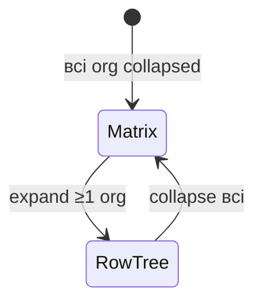

# Специфікація Org Hierarchy SDK — алгоритми та стан

> Документ зафіксовано за результатами обговорення та поточної імплементації.  
> Дата: 2026-08-20. Версія scope: **v1**.

---

## 1. Продукт

**Embed-бібліотека** `@org-hierarchy/sdk` для діаграм:

- **Організаційної ієрархії** (~50 000 org, matrix / row-tree)
- **Штатно-посадової структури** (dept contours, person nodes)

Host завантажує дані зовні → передає через `DataMapper` → `OrgHierarchyDiagram.create()`.

| Параметр | Значення |
|----------|----------|
| Масштаб dataset | ~50k org, ~2M persons |
| Одночасний рендер | viewport + LOD (не всі 2M nodes) |
| Логіка | клієнт (browser) |
| Threading | Web Worker (не Service Worker) |
| Core compute | Rust → WASM |
| Render | Pixi.js WebGL |
| Bundler | Rsbuild |
| Export (v1) | SVG, PNG, PDF, print |

---

## 2. Режими відображення

### 2.1 Організації



| Режим | Умова | Layout |
|-------|-------|--------|
| **Matrix** | Усі org `collapsed: true` | Sparse adjacency між org; порядок змінюється D&D |
| **Row-tree** | ≥1 org expanded | Рядки за depth: row 1, 2, 3… |

**Алгоритм row-tree** (WASM `layout.rs` — Reingold-Tilford variant):

1. Побудувати `HierarchyNode` з flat/parent links
2. `first_walk` — prelim coords, resolve subtree overlap
3. `second_walk` — final x,y з mod accumulators
4. Зібрати `LayoutNode[]` + `LayoutEdge[]` (orthogonal edge paths)
5. Normalize bounds + margin offset

**Matrix layout** (planned, не в WASM):

1. Collapsed org → node у sparse grid або force-directed adjacency
2. Edges між org за `orgLinks` / parent-child
3. D&D → reorder index у matrix row/column

### 2.2 Штатка (staff)

- Positions на координатній сітці `(col, row)` або `(layoutX, layoutY)`
- Групування: department → org → group
- Dept = **один зовнішній контур** (DepartmentBlob), не grid boxes
- Person/Position = окремі PersonNode поверх contour

---

## 3. Алгоритм контуру департаменту (магнетизм)

**Референс:** `packages/core/src/contour.rs`  
**Правила:** `docs/REQUIREMENTS.md` §4.6, §4.6.1

### 3.1 Вхід / вихід

```ts
interface ContourPositionInput {
  id: string;
  departmentId: string;
  col: number;   // grid column
  row: number;   // grid row
}

interface ContourMagnetConfig {
  paddingCells?: number;      // default 0
  corridorCells?: number;     // default 0 — gap до foreign (G2)
  cellWidth?: number;         // default 100 px
  cellHeight?: number;        // default 80 px
  smoothIterations?: number;  // Chaikin, default 2
}

interface DeptContourResult {
  departmentId: string;
  points: { x: number; y: number }[];
  path: string;               // SVG path "M … L … Z"
  cornerCount: number;        // до smoothing
}
```

WASM exports: `computeDeptContour`, `computeAllContours`  
SDK bridge: `packages/sdk/src/contour/bridge.ts`

### 3.2 Кроки алгоритму (реалізовано)

```
┌─────────────────────────────────────────────────────────────┐
│ 1. OWN CELLS                                                │
│    own = { (col,row) | position.departmentId == targetDept }│
├─────────────────────────────────────────────────────────────┤
│ 2. FOREIGN EXPANSION (G2)                                   │
│    foreign = cells інших dept, розширені на ±corridorCells   │
├─────────────────────────────────────────────────────────────┤
│ 3. BBOX                                                     │
│    bbox = union(own ∪ foreign) + padding                    │
├─────────────────────────────────────────────────────────────┤
│ 4. FLOOD-FILL INSIDE (M2, M3, G5)                           │
│    inside = BFS від own cells:                                │
│      • додає reachable empty cells                          │
│      • блокує foreign cells                                   │
│    → empty між own стають internal space, не internal lines  │
├─────────────────────────────────────────────────────────────┤
│ 5. ORTHOGONAL PERIMETER WALK (G3, G4)                       │
│    Для кожної inside cell — 4 boundary edges                │
│    Chain edges → closed polygon (clockwise)                 │
│    G6 (no far-side wall) — implicit через flood exclusion   │
├─────────────────────────────────────────────────────────────┤
│ 6. CHAIKIN SMOOTHING (G4)                                   │
│    smoothIterations ітерацій corner cutting                 │
├─────────────────────────────────────────────────────────────┤
│ 7. OUTPUT                                                   │
│    points (px) = grid × cellWidth/Height                    │
│    path = SVG M/L/Z                                         │
└─────────────────────────────────────────────────────────────┘
```

### 3.3 Правила магнетизму (G1–G8)

| ID | Правило | Статус impl |
|----|---------|-------------|
| G1 | Attract own — злиття own cells | ✅ через flood-fill з own seed |
| G2 | Repel foreign — gap/corridor | ✅ `corridorCells` expansion |
| G3 | No internal edges | ✅ perimeter walk лише зовнішній |
| G4 | Orthogonal first → smooth | ✅ trace + Chaikin |
| G5 | Prefer notch (C-notch) | ✅ flood не включає foreign |
| G6 | No far-side wall | ⚠️ implicit; немає окремого post-pass |
| G7 | Padding snap | ✅ `paddingCells` у bbox |
| G8 | Stable under drag | ❌ потребує incremental recompute + Pixi |

| ID | Membership | Статус |
|----|------------|--------|
| M1 | Лише own dept positions | ✅ |
| M2 | Foreign не в fill | ✅ |
| M3 | Empty між own = internal | ✅ |
| M4 | Disconnected own → multiple contours | ❌ не реалізовано |

### 3.4 Канонічні тест-кейси

**Variant A (2×2, notch):**

```
         col0     col1
row0      P1       P2      IT
row1      P4       P3      P4=CEO
```

**Variant B (фінальний ескіз):**

```
         col0     col1     col2
row0      P1       P2       P3      IT
row1               P4              CEO
row2      P5                P6      IT
```

Критично: **справа від P4 (CEO) немає вертикальної лінії** контуру IT.

Demo positions: `VARIANT_B_POSITIONS` у `packages/sdk/src/contour/bridge.ts`

### 3.5 Pseudocode (повний)

```text
function computeDeptContour(deptId, positions, config):
  own ← cells where departmentId == deptId
  if own.empty: error

  foreign ← ∅
  for p in positions where p.departmentId != deptId:
    for dc, dr in [-corridor..+corridor]²:
      foreign.add(expand(p, dc, dr))

  bbox ← boundingBox(own ∪ foreign, pad = paddingCells + 1)
  inside ← floodFill(seeds=own, blocked=foreign, bounds=bbox)
  corners ← traceOrthogonalPerimeter(inside)
  smooth ← chaikin(corners, smoothIterations)
  return { points: scale(smooth), path: toSvg(smooth) }
```

---

## 4. Модель даних (DiagramData)

```ts
interface DiagramData {
  organizations: DiagramOrganization[];
  groups: DiagramGroup[];
  departments: DiagramDepartment[];
  persons: DiagramPerson[];
  positions: DiagramPosition[];
  reportLines: ReportLine[];
  orgLinks?: OrgLink[];
}
```

**Position** (staff grid):

```ts
interface DiagramPosition {
  id: string;
  title: string;
  organizationId: string;
  departmentId?: string;
  col?: number;              // grid для contour
  row?: number;
  layoutCoords?: Point2D;    // drag override
  isTemporary: boolean;
  status: 'filled' | 'vacant' | 'acting';
  assignments: PositionAssignment[];
}
```

**Mapper flow:**

```
Host raw data
  → DataMapper.toDiagram(raw)
  → optional normalize
  → DiagramData in OrgHierarchyDiagram
  → optional WorkerPool chunks (2M rows)
```

---

## 5. Архітектура runtime

```
┌──────────────────────────────────────────────────────────┐
│ Main thread                                               │
│  • Pixi Application + viewport                           │
│  • OrganizationNode / PersonNode / DepartmentBlob        │
│  • Input: click, context menu, D&D                       │
│  • Theme (light/dark org symbols)                        │
├──────────────────────────────────────────────────────────┤
│ Web Worker(s)                                            │
│  • mapInWorker / WorkerPool / createWorkerPipeline       │
│  • WASM: layout, contour, (future: dept tetris pack)     │
├──────────────────────────────────────────────────────────┤
│ WASM (org-hierarchy-core)                                │
│  • buildFromFlat, computeLayout, treeStats               │
│  • computeDeptContour, computeAllContours                │
└──────────────────────────────────────────────────────────┘
```

### 5.1 LOD / viewport (planned)

| Zoom | Person | Department | Organization |
|------|--------|------------|--------------|
| Far | dot / hidden | simplified polygon + count badge | icon only |
| Mid | compact card | full contour | card |
| Near | full card + photo | full contour + label | full card + emblem |

### 5.2 Incremental data

```
appendData(chunk) → mapper.append? → mergePartial(DiagramData)
  → diff visible viewport nodes
  → recompute affected dept contours only
```

---

## 6. Три візуальні профілі

| Profile | Class | Shape | Fields |
|---------|-------|-------|--------|
| OrganizationNode | matrix, row-tree | Horizontal card | name, group, emblem, theme symbol |
| DepartmentBlob | staff | Organic SVG path | label on contour, fill/stroke |
| PersonNode | staff | Vertical card | photo, ПІБ, title, temp badge |

**Pixi layering (planned):**

```
z-order bottom → top:
  1. DepartmentBlob (Graphics from contour.path)
  2. Report lines / edges
  3. PersonNode / PositionNode
  4. OrganizationNode (org modes)
  5. Selection / focus overlay
```

---

## 7. Взаємодія (planned)

| Дія | Поведінка | Залежності |
|-----|-----------|------------|
| Click | select / focus | Pixi hit areas |
| Context menu | SDK items + host override | callbacks |
| Search | find → expand path → focus | org tree + person index |
| D&D org (matrix) | reorder | matrix layout state |
| D&D person | update col/row or layoutCoords | contour recompute (G8) |
| Block shift ↑↓ | shift hierarchyLevel block | WASM pack + contour |
| Export | SVG/PNG/PDF/print | Pixi extract / custom SVG |

---

## 8. Поточна імплементація

### 8.1 Готово

| Компонент | Шлях | Примітки |
|-----------|------|----------|
| Contour WASM | `packages/core/src/contour.rs` | 4 unit tests |
| Layout WASM | `packages/core/src/layout.rs` | Reingold-Tilford, не підключено до SDK |
| Hierarchy build | `packages/core/src/hierarchy.rs` | flat → tree |
| WASM bindings | `packages/core/src/lib.rs` | buildFromFlat, computeLayout, contour |
| SDK types | `packages/sdk/src/data/types.ts` | DiagramData |
| Mappers | `packages/sdk/src/mappers/` | flatRowsToDiagram, compose |
| Worker | `packages/sdk/src/worker/` | WorkerPool, pipeline, bridge |
| Contour bridge | `packages/sdk/src/contour/bridge.ts` | initContourWasm, compute* |
| SDK skeleton | `packages/sdk/src/index.ts` | OrgHierarchyDiagram без render |

### 8.2 Не реалізовано

- Pixi renderer (всі 3 node types)
- Org matrix layout
- Row-tree інтеграція в SDK
- Search + path expand
- D&D, block shift
- Export
- Rsbuild demo (замість legacy `packages/web`)
- Contour M4 (multiple components per dept)
- Explicit G6 post-processing

---

## 9. Публічний API (target)

```ts
import {
  OrgHierarchyDiagram,
  computeDeptContour,
  computeAllContours,
  VARIANT_B_POSITIONS,
  flatRowsToDiagram,
  WorkerPool,
} from '@org-hierarchy/sdk';

// Mount
const diagram = await OrgHierarchyDiagram.create(container, {
  data: rawRows,
  mappers: { toDiagram: myMapper },
  theme: 'auto',
  workerPoolSize: 4,
  onNodeClick: (node) => {},
  onLayoutChange: (patch) => {},
});

// Contour (main or worker)
const contour = await computeDeptContour('IT', positions, {
  paddingCells: 0,
  corridorCells: 0,
  cellWidth: 100,
  cellHeight: 80,
  smoothIterations: 2,
});
// contour.path → Pixi DepartmentBlob

diagram.destroy();
```

---

## 10. Відкриті питання

1. Context menu — фіксований SDK набір vs повністю custom від host?
2. Persist drag — `onLayoutChange` callback vs SDK → API?
3. Theme — CSS variables vs prop `theme: 'light'|'dark'|'auto'`?

---

## 11. Фази (roadmap)

| Фаза | Scope | Статус |
|------|-------|--------|
| 1 Foundation | monorepo, WASM, mappers, worker, types | 🟡 частково |
| 2 Org modes | matrix, row-tree, search, D&D org | 🔴 |
| 3 Staff | 3 renderers, contour Pixi, D&D person, block shift | 🟡 contour WASM ✅ |
| 4 Polish | context menu, export, docs | 🔴 |

---

## 12. Процес розробки — TDD (обов'язково)

> Повна політика: [`work/TDD.md`](./TDD.md)

### Правило

**Перед написанням production-коду — спочатку тести.** Кожна feature проходить цикл **Red → Green → Refactor**.

### Два обов'язкові класи тестів

| Клас | Що перевіряємо |
|------|------------------|
| **Success** | Happy path — коректний вхід → очікуваний результат |
| **Failure** | Invalid/empty/boundary — помилка, reject, `Err`, throw |

Без обох класів задача **не вважається завершеною**.

### Інструменти

| Шар | Runner | Команда |
|-----|--------|---------|
| Rust WASM | `cargo test` | `npm run test:rust` |
| TypeScript SDK | Vitest (додати) | `npm run test -w @org-hierarchy/sdk` |

### Workflow на задачу

1. Acceptance criteria з `work/tasks/T*.md` → список success + failure тестів
2. Commit тестів (RED — падають)
3. Мінімальний impl (GREEN)
4. Refactor без зміни поведінки
5. CI: tests + typecheck + build:wasm

### Приклад (contour)

```
RED:    test compute_contour_empty_dept_returns_err  → FAIL (no test yet)
GREEN:  impl returns Err for empty own cells       → PASS
REFACTOR: extract helper if needed                 → PASS
```

---

## 13. Стандарти TypeScript-коду (обов’язково)

> Повна політика: [`work/CODING_STANDARDS.md`](./CODING_STANDARDS.md)

TypeScript у `packages/sdk` / `packages/demo` пишеться за правилами **Clean Code**, **Clean Architecture**, **SOLID**, **DRY**, **KISS** і вибіркових **GoF**-патернів.  
**Стиль TypeScript** — за рекомендаціями **Matt Pocock** (Total TypeScript). Повна політика: [`CODING_STANDARDS.md`](./CODING_STANDARDS.md).

### 13.1 Ієрархія при конфлікті

```
KISS → SOLID → DRY → Clean Code → Clean Architecture → GoF
Matt Pocock TS rules — як писати типи (паралельно до архітектури)
```

Патерн або шар абстракції **не додаємо** «на виріст». Якщо принцип суперечить простоті на ранньому етапі — спочатку KISS, поки не з’явиться другий споживач або вимір (профіль).

### 13.2 Clean Code (коротко)

| Вимога | Деталі |
|--------|--------|
| Імена | Намір у назві (`expandOrg`, не `handle`) |
| Функції | Одна дія; мало аргументів; options-object якщо >3 |
| Pure compute | Layout / validate / map — без DOM/Pixi |
| Fail fast | Invalid → throw/`Err`, не тихий wrong state |
| Boy Scout | Кожен PR чистить зачеплений модуль |

### 13.2b Matt Pocock — TypeScript (обов’язково)

| Правило | Вимога |
|---------|--------|
| Без `enum` | `as const` + derived union |
| Infer за замовчуванням | Return type не на кожній внутрішній функції |
| Library exports | Публічний SDK API — **явні** param + return types |
| `satisfies` | Конфіги/maps без втрати infer |
| Без `any` | `unknown` + narrowing |
| Generics | Лише коли тип динамічний і впливає на результат |
| Межі | Zod (або еквівалент) для host/worker входу |
| Exhaustiveness | `assertNever` у `switch` по union |
| Compiler | `strict`; бажано `noUncheckedIndexedAccess` |

Референс: [totaltypescript.com](https://www.totaltypescript.com/) (Matt Pocock).

### 13.3 Clean Architecture — Dependency Rule

Залежності лише **всередину**:

```
Pixi / Worker / WASM glue
        ↓
Adapters (bridges, mappers, Diagram facade)
        ↓
Application (expand/collapse → layout, setData)
        ↓
Domain (DiagramData, layout contracts, org rules)
```

- `DiagramData` — єдине джерело правди стану.
- `LayoutResult` — view-model; не мутує domain «по дорозі».
- Domain **не** імпортує `render/`, Pixi, Worker.

### 13.4 SOLID у цьому SDK

| Принцип | Застосування |
|---------|--------------|
| **S** | Окремі модулі: matrix / row-tree / renderer / worker |
| **O** | Новий layout/edge style через strategy/options, не гігантський `switch` |
| **L** | Вузли/результати layout взаємозамінні без ламких `instanceof` |
| **I** | Вузькі callbacks замість одного God-interface |
| **D** | Renderer залежить від портів (`ContourComputer`), не від конкретного wasm-файлу |

### 13.5 DRY / KISS

- DRY — **одна правда** бізнес-правила (collapse, eject, validate), не заборона схожих рядків glue.
- KISS — без DI-container / EventBus «на майбутнє»; stateful tidy-session лише після обґрунтування (часті expand/collapse + профіль).

### 13.6 GoF (дозволений мінімум)

| Патерн | Де очікуємо |
|--------|-------------|
| Facade | `OrgHierarchyDiagram` |
| Adapter | `layoutBridge`, mappers, wasm |
| Strategy | matrix vs row-tree; edge style |
| Observer | host callbacks |
| Factory | `create()`, worker factory |
| Command (легкий) | `LayoutPatch` |

Заборонено AbstractFactory / глибокі ієрархії class заради патерну.

### 13.7 Definition of Done (фрагмент)

Окрім TDD success+failure:

- [ ] Немає порушення Dependency Rule
- [ ] Немає необґрунтованого `any` / `@ts-ignore` / нового `enum`
- [ ] Публічні SDK exports з явними return types (Matt Pocock library rule)
- [ ] Немає роз’їзду правил TS↔Rust без позначеного source of truth
- [ ] Немає нового GoF-шару без другого споживача

### 13.8 Зв’язок з expand/collapse

Частий relayout **не** виправдовує змішування шарів (layout усередині Pixi click-handler). Жест:

1. Application змінює `DiagramData` (collapsed)
2. Один виклик layout (adapter → WASM)
3. Renderer застосовує `LayoutResult` (+ опційна анімація from→to)

Так уникаємо «GoJS-костилів»: два джерела правди і layout посеред анімації.