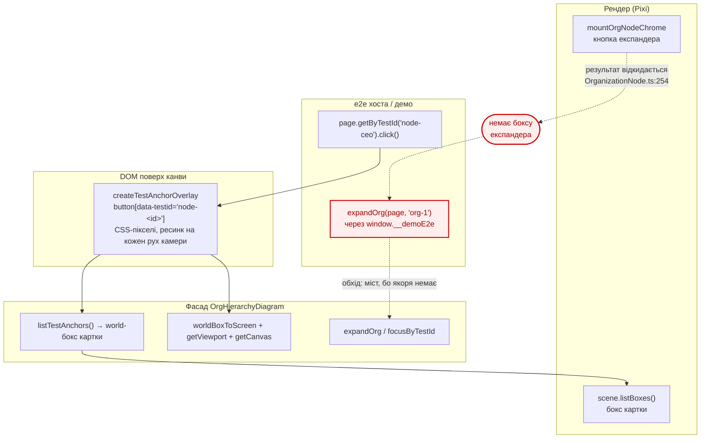

# T115 — два рішення, що лишились: якір експандера і гейт

**Дата:** 2026-09-08 · **Базис:** `main` @ `95ec90e` · **Вимір:**
[`measurement.md`](./measurement.md) · **Задача:**
[T115](../../tasks/T115-test-seam-parity-with-host.md)

Кроки 1 і 3 закриті кодом. Ці два — ні, і не тому, що на них не вистачило часу: **обидва
додають або фіксують публічний контракт**, тобто це рішення, а не виконання.

---

## Як шов виглядає сьогодні

Суцільні стрілки — шлях, який працює. Пунктир — те, чим його обходять, бо однієї коробки бракує.

🔑 **Це не гіпотеза про хост — це наш власний код.** `e2e/flat-orgs.spec.ts:72` клікає вузол через
DOM-якір і працює. А розгортання в тому ж файлі йде через `expandOrg(page, 'org-1')`
(`e2e/demoBridge.ts:5-9`), тобто через `window.__demoE2e`. **Міст, який T115 хоче прибрати в
хоста, живий у нас — рівно в тій точці, де якоря немає.** Дірка не теоретична; ми вже платимо за
неї щодня.

---

## Рішення 1 — чи давати якір експандера

### Чому ззовні його не обчислити

Кут кнопки залежить від режиму сцени, і режимів більше, ніж здається:

| Умова | Де кнопка | Джерело |
|---|---|---|
| `gojsTree` | центр `(w − 13, h − 13)`, d = 26 — **низ-право** | `render/orgNodeChrome.ts:42-48` |
| дерево, звичайне | `x = w − 26, y = 4` — **верх-право** | `:95-106` |
| штат (chevron ▲/▼) | той самий верхньо-правий слот | `:107-117` |

Перемикач — не одна опція, а вираз:
`gojsTree = isGojsVertical(style) && style.gojsTreeExpander !== false`
(`render/OrganizationNode.ts:248`).

І два випадки, коли кнопки **немає взагалі**:

- `lod === 'far'` → chrome не монтується зовсім (`OrganizationNode.ts:246`);
- `chrome.kind === 'staff-expand' && gojsTree` → ранній вихід (`:251-253`).

**Це і є головний аргумент за необов'язкове поле:** експандер — не властивість вузла, а
властивість вузла **в поточному кадрі**. Обов'язкове поле брехало б у двох режимах із чотирьох.

### Що доведеться зробити в коді

`mountOrgNodeChrome` **уже повертає** `{ expandButton?: Container }` — і цей результат
**відкидається** на `OrganizationNode.ts:254`. Тобто дані існують і викидаються за рядок до того,
як стали б корисні. Робота: утримати їх, підняти в `scene.listBoxes()` поруч із боксом картки,
і додати поле в `TestAnchorCandidate`.

### Варіанти

| # | Форма | Ламальність | Що дає | Що коштує |
|---|---|---|---|---|
| **A** | `expander?: WorldBox` у `TestAnchorCandidate` + другий якір `node-<id>-expander` в оверлеї | **не ламальна** (поле необов'язкове) | і DOM-шлях, і піксельний; чесно відсутнє там, де кнопки немає | утримати мітку в рендері, протягти крізь сцену |
| B | те саме, але поле обов'язкове | **ламальна** | тип «завжди є» простіший | брехня в двох режимах — доведеться підставляти бокс картки |
| C | окремий метод `listExpanderAnchors()` | не ламальна | не чіпає наявний тип | другий обхід сцени й другий список, який може розійтись із першим |
| D | нічого не робити | — | нуль коду | хост лишається на мості **і ми теж** — дірка вже виміряна в нашому репо |

### Рекомендація — **A**, але спершу одне питання до хоста

A виграє тому, що необов'язковість тут не поступка сумісності, а **точне відображення
реальності**: кнопки справді може не бути.

⚠️ Але перед роботою варто спитати хост прямо: їм потрібно **клікнути по експандеру** чи
**перевірити, що розгортання працює**? Це різні потреби:

- якщо друге — вистачає `expandOrg()` / `focusByTestId()`, і A не потрібна взагалі;
- якщо перше (тобто тестується сам віджет: «клік по картці ≠ клік по кнопці, сайдбар не має
  відкритись») — A обов'язкова, бо саме цю різницю ніяк інакше не виразити.

Хост уже сказав, що «Expander != node-click» для нього принципове — це схиляє до першого. Але
сказано це було про **свій** віджет, не про наш, тож питання лишається чесним.

---

## Рішення 2 — гейт: хто вимикає шов у проді

### Факти

| Хто | Чим гейтить | Джерело |
|---|---|---|
| хост | `import.meta.env.DEV`, у проді моста немає | T115 §«Що сказав хост» |
| наше **демо** | `if (!this.e2eMode) return;` — оверлей монтується лише при `?e2e=1` | `packages/demo/src/app/App.ts:600-605` |
| наш **SDK** | **нічим** — оверлей вмикає той, хто його викликав | `react/createTestAnchorOverlay.ts` |

### 🔴 Реальна небезпека, а не теоретична

При `interactive: true` якорі отримують `pointerEvents: 'auto'` і `opacity: 0.001`
(`createTestAnchorOverlay.ts:78-80`). Це **невидимі клікабельні кнопки поверх карток**. Лишити
таке в проді — віддати кліки користувача оверлею замість канви. При `interactive: false`
(типове) вони `pointerEvents: 'none'` і нікому не заважають — але тоді `.click()` б'є вже в
канву, і Playwright сам вирішує, чи це його влаштовує.

Тобто небезпечний не оверлей, а **саме `interactive: true`**, і це рівно той аргумент, який має
стояти в доці великими літерами.

### Варіанти

| # | Хто гейтить | Оцінка |
|---|---|---|
| **1** | **хост, а SDK це прямо документує** | 🟢 SDK не знає бандлера хоста; читати `import.meta.env` у бібліотеці = зашити припущення про збірку. Оверлей інертний, поки його не змонтували, тож дефолт уже безпечний |
| 2 | SDK читає `import.meta.env.DEV` сам | 🔴 ламає всіх, хто не на Vite; у Rsbuild-демо це інша змінна. Бібліотека почне залежати від тулчейна споживача |
| 3 | окремий підшлях `@org-hierarchy/sdk/testing`, який tree-shake викидає з прод-бандла | 🟡 найчесніше технічно, але це нова точка входу в `package.json#exports` — тобто знову рішення про публічну поверхню, і більше роботи, ніж вартує |

### Рекомендація — **1**, з двома конкретними діями

1. Дописати в §14 `USAGE.md` абзац: `interactive: true` — **тільки під гейтом середовища**, з
   поясненням про невидимі кнопки поверх канви. Зараз доки про це не каже, а це найдорожча
   помилка, яку споживач може зробити з цим API.
2. Назвати **наше демо** зразком гейта (`?e2e=1` → `e2eMode`) — у нас уже є працююча відповідь,
   просто ніде не сказано, що вона зразкова.

Це не потребує ані нового коду в SDK, ані нової точки входу — лише зафіксувати контракт, який
де-факто вже діє.

---

## Підсумок для рішення

| Пункт | Що вирішити | Моя рекомендація |
|---|---|---|
| Якір експандера | давати чи ні, і в якій формі | **A** — необов'язкове поле + другий якір; **але спершу спитати хост**, їм потрібен клік чи стан |
| Гейт | хто вимикає в проді | **1** — гейтить хост, SDK документує; додати попередження про `interactive: true` і назвати демо зразком |

Обидва пункти можна робити незалежно. Другий — дешевий і без коду; перший — торкається рендера,
сцени й публічного типу, тож іде через `spec-flow`.
