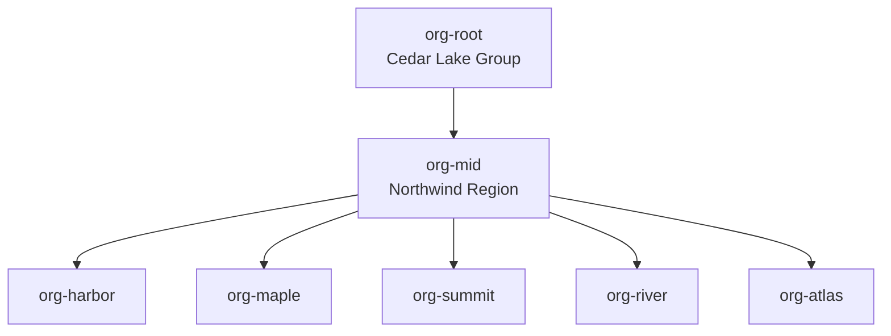
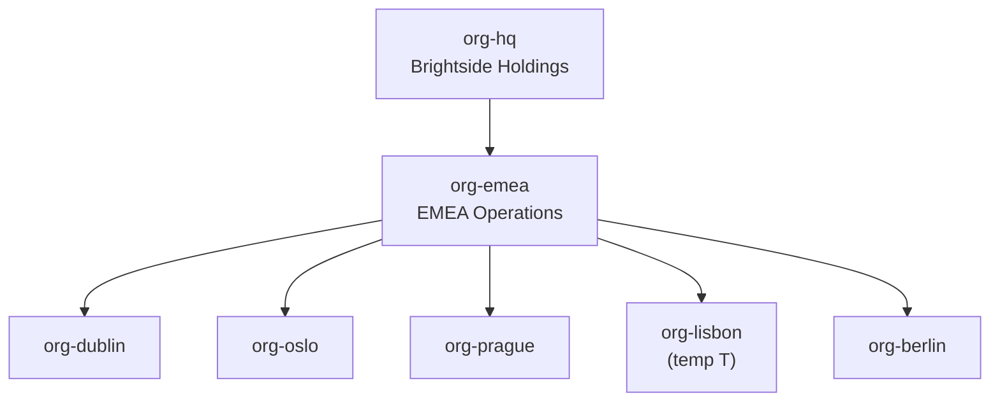
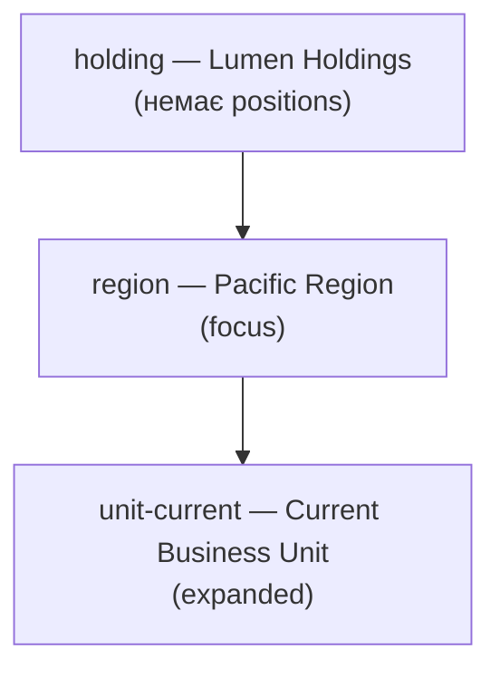
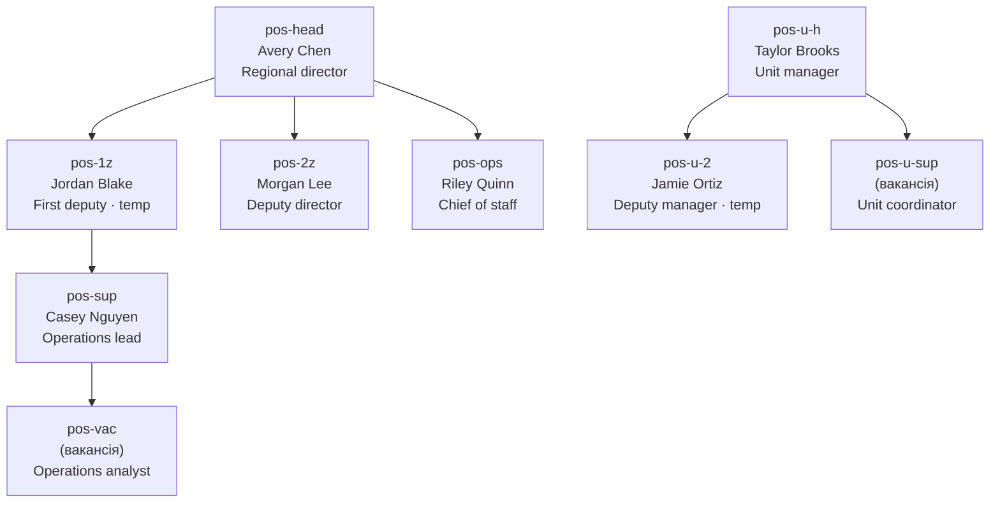

# Mockup edge map — discussion draft

**Status:** ✅ **Closed** (2026-08-23) — see [MOCKUP-parity-remaining.md](./MOCKUP-parity-remaining.md)  
**Date:** 2026-08-23  
**Screenshots:** `e2e/mockups.spec.ts-snapshots/*.png` (Playwright baselines)  
**Related:** [MOCKUP-styles-review.md](./MOCKUP-styles-review.md)

Цей документ — **окрема мапа звʼязків**, незалежна від стилів карток. Мета: звірити топологію на скрінах з fixture-даними, алгоритмами layout і правилами з Figma/GoJS.

---

## Легенда типів ребер

| Kind | Джерело | Стиль на canvas | Стрілка |
|---|---|---|---|
| `parentOrgId` | `organizations[].parentOrgId` | spine-bus (org layout) | так |
| `admin` | `reportLines` (`kind: 'admin'`) | суцільна | так |
| `matrix` | `reportLines` | штрих-крапка `[6,4]` | ні |
| `dotted` | `reportLines` | штрих-крапка `[2,4]` | ні |
| `cross-tier` | **алгоритм** `layoutStaffCanvas` | як admin (суцільна) | так |

> **Важливо:** `cross-tier` **не** в `reportLines` — генерується SDK (T34 A3): head поточної org → tier-3 org cards; head managing org → head поточної org.

---

## 1. Orgs · Figma

**Скрін:** `mockup-orgs-figma-linux.png`

### Мапа (дані → `parentOrgId`)



| # | From | To | Kind | На скріні | Коментар |
|---|---|---|---|---|---|
| 1 | org-root | org-mid | parentOrgId | ✅ | вертикаль root→mid |
| 2–6 | org-mid | 5 divisions | parentOrgId | ✅ | горизонтальний bus + 5 гілок |
| — | sibling frame | 5 peers | chrome | ✅ | dashed blue AABB (не edge) |

**reportLines / orgLinks:** порожні — очікувано.

**Що бачу на скріні:** дерево повне, 7 вузлів, 6 ребер. Логіка відповідає fixture. Проблем не бачу.

---

## 2. Orgs · GoJS

**Скрін:** `mockup-orgs-gojs-linux.png`

### Мапа



| # | From | To | Kind | На скріні | Коментар |
|---|---|---|---|---|---|
| 1 | org-hq | org-emea | parentOrgId | ✅ | |
| 2–6 | org-emea | 5 hubs | parentOrgId | ✅ | |
| — | sibling frame | — | chrome | ✅ off | за правилами GoJS mockup |

**Що бачу:** 6 ребер, period/unit/T на картках — ок. Ребра повні.

---

## 3. Staff · Figma

**Скрін:** `mockup-staff-figma-linux.png`  
**Focus org:** `region` (Pacific Region)  
**Expanded tier-3:** `unit-current`

### Орг-дерево (контекст, не малюється як staff edges)



### Мапа A — `reportLines` у fixture (джерело істини для admin)



### Мапа B — що реально малює SDK (+ cross-tier)

| # | From | To | Kind | У fixture | На скріні | Коментар |
|---|---|---|---|---|---|---|
| 1 | pos-head | pos-1z | admin | ✅ | ✅ | bus від Avery → Jordan |
| 2 | pos-head | pos-2z | admin | ✅ | ✅ | → Morgan |
| 3 | pos-head | pos-ops | admin | ✅ | ✅ | → Riley |
| 4 | pos-1z | pos-sup | admin | ✅ | ✅ | Jordan → Casey (Operations desk) |
| 5 | pos-sup | pos-vac | admin | ✅ | ✅ | Casey → vacant |
| 6 | pos-u-h | pos-u-2 | admin | ✅ | ✅ | Taylor → Jamie |
| 7 | pos-u-h | pos-u-sup | admin | ✅ | ✅ | Taylor → vacant |
| 8 | **pos-head** | **unit-current** (org card) | **cross-tier** | ❌ auto | ✅ | довга вертикаль до org card |
| 9 | pos-1z | pos-u-h | dotted | ❌ **немає** | ❌ **немає** | ⚠️ див. розділ «Розбіжності» |
| 10 | holding head | pos-head | cross-tier | ❌ | ❌ | holding без positions → tier-1 пропущено |

### Що бачу на скріні (Staff · Figma)

1. **Avery Chen** зверху, три прямі підлеглі на одному bus (Jordan, Morgan, Riley) — збігається з #1–3.
2. **Jordan → Casey → vacant** у зоні «Operations desk» — #4–5.
3. **Current Business Unit** — org card на tier-3, з’єднана **суцільною** лінією від bus Avery (не від Jordan) — це #8 `cross-tier`.
4. Під розгорнутим unit: **Taylor → Jamie + vacant** — #6–7.
5. **Немає пунктирного** ребра між Jordan (deputy) і Taylor (unit manager).
6. **Немає tier-1** (Lumen Holdings CEO) — holding org існує, але positions порожні.

---

## 4. Staff · GoJS

**Скрін:** `mockup-staff-gojs-linux.png`  
**Та сама топологія** що Staff · Figma (інший chrome).

### Що бачу на скріні (відмінності від Figma)

| Спостереження | Очікування (дані) | Статус |
|---|---|---|
| Ті самі 7 admin + 1 cross-tier | так | ✅ (логічно) |
| Portrait seats, blob depts | chrome | ✅ |
| **Avery Chen (head)** | має бути над bus | ⚠️ на скріні head **майже не читається** / обрізаний — e2e все ж перевіряє `node-staff-head` visible |
| Лінія до **Current Business Unit** | `pos-head → unit-current` | ⚠️ візуально здається, що йде від **колонки Riley** (ліворуч на bus) — можлива **геометрія routing**, не інша топологія |
| Dotted deputy → unit mgr | [MOCKUP-styles-review §3](./MOCKUP-styles-review.md) | ❌ немає |

---

## Розбіжності (для обговорення)

### R1 — Approved rule vs fixture: dotted cross-org

| Джерело | Текст |
|---|---|
| **MOCKUP-styles-review.md §3** | «Edges: solid admin; **dotted cross-org (deputy → unit manager)**» |
| **mockups.ts** | `reportLines` без `dotted` |
| **mockups.test.ts** | явно: `no cross-tier dotted edge` |
| **Скрін** | dotted немає |

**Питання:** повертаємо `{ fromId: 'pos-1z', toId: 'pos-u-h', kind: 'dotted' }` як decorative edge (SPEC: не впливає на layout)?

---

### R2 — Cross-tier до org card vs dotted до людини

Зараз SDK малює:

```
pos-head ──cross-tier──► [Current Business Unit card]
                              └── expand ──► pos-u-h (Taylor)
```

Approved mockup натомість натякає на **dotted між людьми** (deputy ↔ unit manager), а не solid до org card.

**Питання:** на Figma/GoJS референсі лінія йде:
- (A) до **org card** «Current Business Unit», чи
- (B) напряму **Jordan Blake → Taylor Brooks** (dotted), чи
- (C) **обидва**?

---

### R3 — Tier-1 holding порожній

`holding` є в org tree, але **немає positions** → tier-1 staff block пропускається → немає cross-tier `holding CEO → Avery`.

**Питання:** потрібен CEO на holding для повної 3-tier staff картини, чи mockup навмисно показує лише region focus?

---

### R4 — Riley Quinn (Chief of staff) як direct report head

У fixture Riley — **admin child** Avery на одному рівні з deputies (#3).

**Питання:** це правильна бізнес-логіка? Альтернатива: Riley під Jordan, або matrix/dotted до head.

---

### R5 — Контракт тест суперечить style doc

Потрібно узгодити одне з двох:
1. Оновити **MOCKUP-styles-review** (прибрати dotted), або
2. Оновити **fixture + тест** (додати dotted, можливо прибрати/змінити cross-tier до card).

---

## Підсумкова таблиця «скрін vs дані»

| Tab | Ребер у даних | Ребер малює SDK | На скріні видно | Бракує / сумнів |
|---|---:|---:|---:|---|
| Orgs · Figma | 6 parentOrgId | 6 | 6 | — |
| Orgs · GoJS | 6 parentOrgId | 6 | 6 | — |
| Staff · Figma | 7 admin | 7 admin + 1 cross-tier | ~8 | dotted deputy→unit mgr; tier-1 holding |
| Staff · GoJS | 7 admin | 7 admin + 1 cross-tier | ~8 | те саме + routing до org card |

---

## Наступний крок (після вашого OK)

1. Узгодити **R1–R3** (що має бути на референсі Figma/GoJS).
2. Оновити `buildStaffTopology().reportLines` + контракт-тест.
3. За потреби — окремий e2e «edge inventory» (список `from→to` з canvas, не pixel diff).
4. Перегенерувати staff snapshots.

---

## Change log

| Date | Action |
|---|---|
| 2026-08-23 | Draft edge map for discussion |
