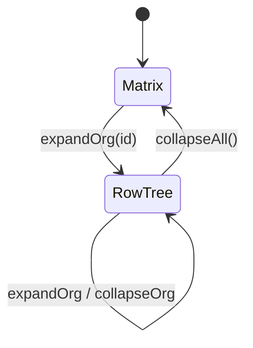

# T03 — Org matrix та row-tree layout

**Пріоритет:** P1  
**Статус:** todo  
**Оцінка складності:** висока  
**Залежності:** T01 (OrganizationNode), WASM layout ✅

---

## Мета

Реалізувати два режими відображення організацій з автоматичним перемиканням за станом `collapsed`.

---

## Режими

### Matrix (усі collapsed)

```
Умова: ∀ org.collapsed === true

Візуал:
  • Org nodes у 2D sparse grid або force layout
  • Edges: orgLinks + parentOrg adjacency
  • D&D → зміна порядку (matrixOrder index)
```

### Row-tree (≥1 expanded)

```
Умова: ∃ org.collapsed === false

Візуал:
  • Rows = depth від root expanded subtree
  • Row 1: root expanded orgs
  • Row 2: children
  • WASM computeLayout(root, { direction: 'vertical' })
```

### State machine



---

## Scope

### 1. SDK layout module

```
packages/sdk/src/layout/
  orgMode.ts           — detect matrix vs row-tree
  matrixLayout.ts      — sparse grid placement
  rowTreeLayout.ts     — bridge to WASM computeLayout
  types.ts
```

### 2. WASM integration

Вже є:

- `buildFromFlat(flatNodes)` → `HierarchyNode`
- `computeLayout(root, options)` → `LayoutResult`

SDK потрібно:

```ts
export async function computeOrgRowTreeLayout(
  organizations: DiagramOrganization[],
  expandedRootId: string,
  options?: LayoutOptions,
): Promise<LayoutResult>;
```

### 3. Matrix layout algorithm (new)

**Input:** `organizations[]`, `orgLinks[]`, optional `matrixOrder: string[]`

**Steps:**

1. Filter collapsed orgs only
2. Build adjacency from orgLinks + parentOrgId
3. Place nodes:
   - Option A: manual grid with row/col from matrixOrder
   - Option B: layered graph (Sugiyama simplified)
4. Edge routing: orthogonal between node centers

**D&D:**

- On drop: swap matrixOrder indices
- Emit `onLayoutChange({ type: 'matrix-reorder', orgId, newIndex })`

### 4. Pixi integration (T01)

- OrganizationNode at LayoutResult positions
- Animate transition matrix ↔ row-tree (optional v1.1)

---

## Data model extensions

```ts
interface DiagramOrganization {
  // existing...
  collapsed?: boolean;
  matrixOrder?: number;   // для matrix mode
}

interface OrgLink {
  fromOrgId: string;
  toOrgId: string;
  kind?: 'admin' | 'matrix' | 'partnership';
}
```

---

## Acceptance criteria

- [ ] 10 org demo: collapsed → matrix view
- [ ] Expand 1 org → switch to row-tree with correct depths
- [ ] Collapse all → back to matrix
- [ ] D&D reorder in matrix updates visual + callback
- [ ] LayoutResult edges drawn between org nodes
- [ ] Performance: 1000 org matrix — layout < 100ms (worker)

---

## Out of scope

- Full 50k org on screen (viewport culling — окремий task)
- Force-directed physics layout

---

## Референси

- `packages/core/src/layout.rs`
- `docs/REQUIREMENTS.md` §2.1
- `work/SPEC.md` §2.1
